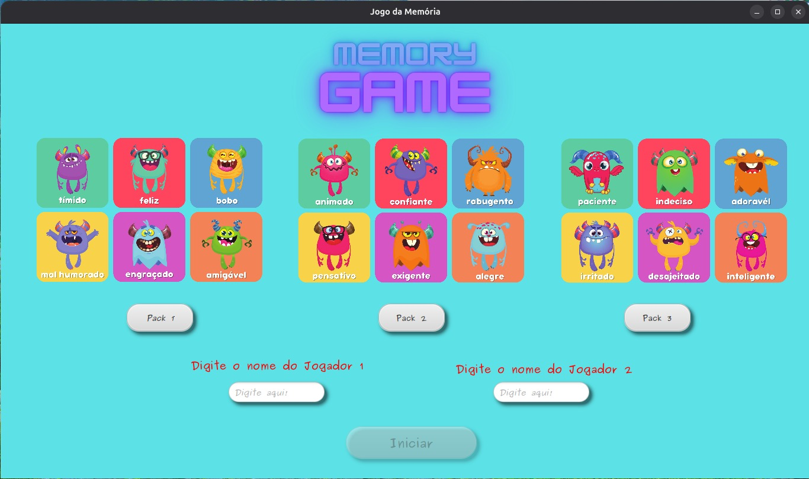
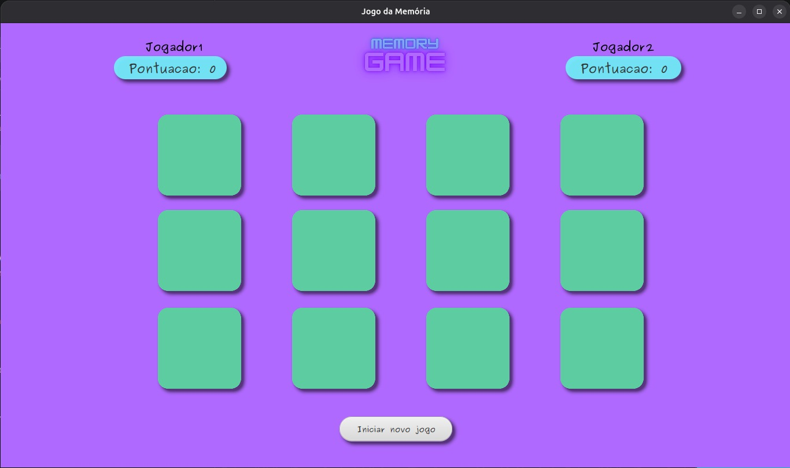

# 🧠 Jogo da Memória

Um jogo da memória desenvolvido em Java com JavaFX. O objetivo é encontrar pares de cartas iguais antes do adversário.

## 🚀 Funcionalidades

- Jogador versus jogador (PvP)
- Sistema de pontuação por pares encontrados
- Alternância de turno entre jogadores
- Interface gráfica amigável com JavaFX
- Reinício de jogo com novo embaralhamento

## 🛠️ Tecnologias utilizadas

- ☕ Java 17
- 💻 JavaFX (interface gráfica)
- 🧪 JUnit + Maven (testes e gerenciamento de dependências)
- 🎨 Scene Builder (montagem visual das telas)

## ▶️ Como executar

1. Clone o repositório:
```bash
git clone https://github.com/Victorozana/jogo-da-memoria.git
```

---
```markdown




